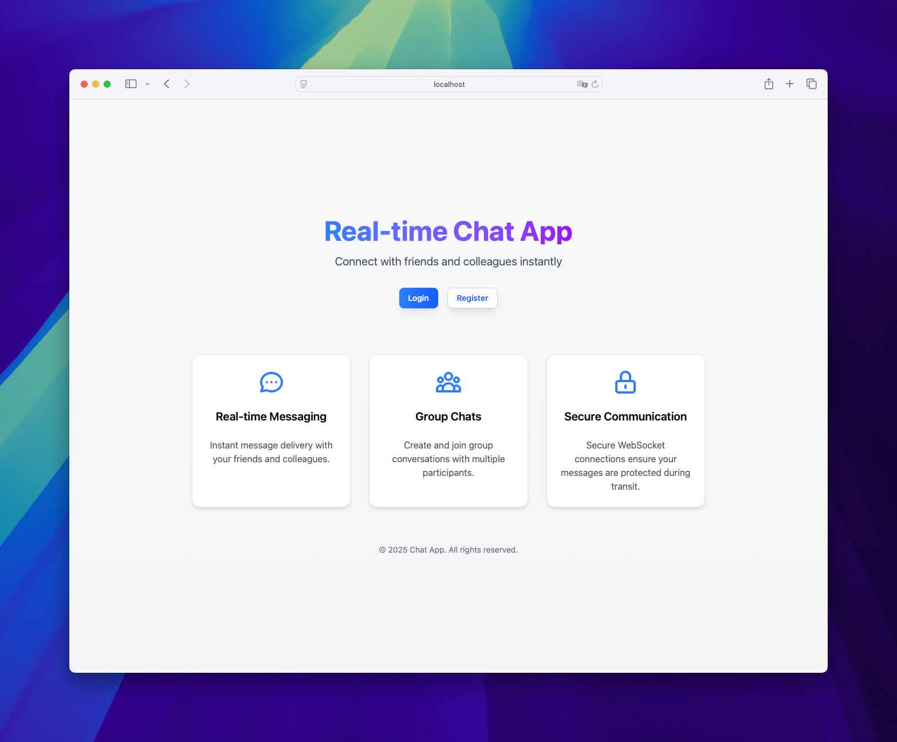

# Chat Service

A full-stack real-time chat application featuring a Go backend with WebSockets, MongoDB for persistent storage, Redis for pub/sub functionality, and a React/Next.js frontend.




## 🌟 Features
- Real-time messaging using WebSocket
- Room-based chat functionality
- User authentication and authorization
- Message persistence with MongoDB
- Session management with Redis
- UI with React/Next.js with Shadcn
- API documentation with Swagger

## 🛠️ Tech Stack
### Backend
- [Go](https://go.dev/)
- [MongoDB](https://www.mongodb.com/)
- [Redis](https://redis.io/)
- [Coder WebSocket](https://github.com/coder/websocket) 
- [Swagger/Swag](https://github.com/swaggo/swag)

### Frontend
- [Next.js](https://nextjs.org/)
- [React](https://react.dev/)
- [TailwindCSS](https://tailwindcss.com/)/[Shadcn](https://ui.shadcn.com/)

## Prerequisites
- Go
- Node.js
- MongoDB
- Redis
- pnpm (preferred)

## 🚀 Getting Started

### Clone the Repository
```bash
git clone https://github.com/vit0rr/chat.git
cd chat
```

### Backend Setup
1. Install dependencies:
```bash
go mod tidy
```

2. Set up environment variables:
```bash
cp .env.example .env
```

3. Run the server:
```bash
go run cmd/api/main.go
```

### Frontend Setup
1. Navigate to the frontend directory:
```bash
cd front
```

2. Install dependencies:
```bash
pnpm install
```

3. Run the development server:
```bash
pnpm run dev
```

## 📚 API Documentation
This project uses Swagger to document the API. The code generation was made using [Swag](https://github.com/swaggo/swag). After updating the documentation - by adding/editing comments in the code - you can run the following command to generate the documentation:
```bash
swag init -d ./cmd/api/,./
```

It will update the `docs` folder with the new documentation. You can access the documentation by running the project and accessing the `/swagger/index.html` endpoint at http://localhost:8080/swagger/index.html.

## Environment Variables
You can check the environment variables needed to run this project in the `.env.example` file. Run the following command to create a `.env` file:
```bash
cp .env.example .env
```

## 🐳 Docker Support
The project includes Docker support for easy deployment. To run the entire stack:
```bash
docker-compose up
```

This will start:
- MongoDB on port 27017
- Redis on port 6379
- Backend API on port 8080
- Frontend on port 3000

## 🚢 Deployment
### Backend
The backend is configured for deployment on Fly.io. Configuration can be found in `fly.toml`.

### Frontend
The frontend can be deployed to Vercel or any other Next.js-compatible hosting platform.

## License
This project is licensed under the MIT License - see the LICENSE file for details.

## Contributing
1. Fork the repository
2. Create your feature branch (`git checkout -b feature/amazing-feature`)
3. Commit your changes (`git commit -m 'Add some amazing feature'`)
4. Push to the branch (`git push origin feature/amazing-feature`)
5. Open a Pull Request